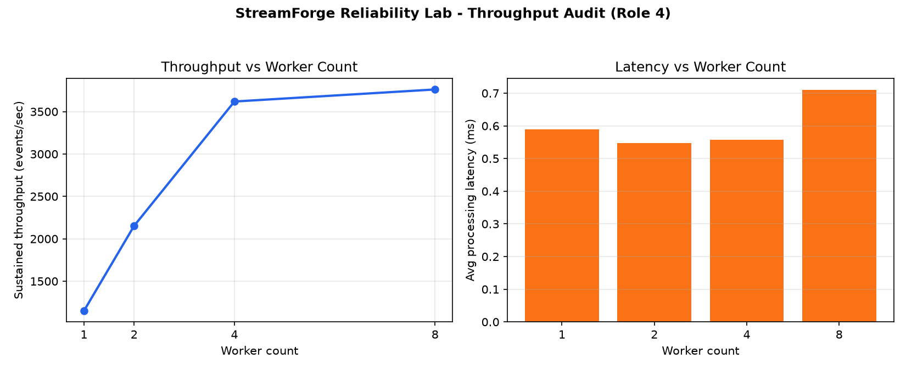

# StreamForge Reliability Lab

A local-first reliability and chaos engineering playground for high-throughput Python event processing.

StreamForge Reliability Lab lets you:
- generate synthetic telemetry events
- process events through multiple Python worker processes
- monitor throughput, latency, errors and worker health
- intentionally stop a worker and watch the supervisor rebalance work
- expose Prometheus metrics
- run a repeatable throughput benchmark
- inspect the system from a clean browser dashboard

> The project is designed for local development in VS Code. Kafka, Prometheus and Grafana are optional integrations; the core demo runs without external services.

## Why this project?

Modern event-driven systems are expected to stay reliable even when traffic spikes or workers fail. This project demonstrates the practical side of Reliability Engineering / SRE:

**Generate → Queue → Workers → Process → Observe → Inject Failure → Recover → Measure**

The project is intentionally transparent: every metric shown on the dashboard is produced by the application itself.

## Features

### Reliability
- Supervisor-managed worker processes
- Automatic worker restart
- Queue-depth monitoring
- Event success/error tracking
- Worker health and restart counters

### Performance
- Configurable event generator
- Throughput benchmark
- Average and p95 processing latency
- Events-per-second measurement
- Backpressure visibility

### Chaos Engineering
- Stop a selected worker
- Simulate worker failure
- Observe queue growth and recovery
- Compare before/after throughput
- Recovery-time measurement

### Observability
- `/metrics` Prometheus endpoint
- JSON health/status endpoints
- Live browser dashboard
- Structured application logs

## Architecture

```text
                   ┌─────────────────────┐
                   │  Event Generator     │
                   │ telemetry simulator  │
                   └──────────┬──────────┘
                              │
                              ▼
                    ┌──────────────────┐
                    │  Shared Queue    │
                    └────────┬─────────┘
                             │
             ┌───────────────┼───────────────┐
             ▼               ▼               ▼
        ┌─────────┐     ┌─────────┐     ┌─────────┐
        │ Worker 1│     │ Worker 2│ ... │ Worker N│
        └────┬────┘     └────┬────┘     └────┬────┘
             │               │               │
             └───────────────┼───────────────┘
                             ▼
                    ┌──────────────────┐
                    │ Metrics Registry │
                    └────────┬─────────┘
                             ▼
                    ┌──────────────────┐
                    │ FastAPI Dashboard│
                    └──────────────────┘
```

## Project structure

```text
streamforge-reliability-lab/
├── app/
│   ├── __init__.py
│   ├── config.py
│   ├── main.py
│   ├── metrics.py
│   ├── models.py
│   ├── supervisor.py
│   └── static/
│       ├── index.html
│       ├── app.js
│       └── styles.css
├── tests/
│   └── test_api.py
├── benchmark.py
├── chaos_demo.py
├── requirements.txt
├── .gitignore
├── Dockerfile
├── docker-compose.yml
└── prometheus.yml
```

## Run in VS Code

### 1. Clone

```bash
git clone <your-repository-url>
cd streamforge-reliability-lab
```

### 2. Create a virtual environment

Windows:

```powershell
python -m venv .venv
.\.venv\Scripts\Activate.ps1
```

macOS/Linux:

```bash
python3 -m venv .venv
source .venv/bin/activate
```

### 3. Install dependencies

```bash
pip install -r requirements.txt
```

### 4. Start the application

```bash
uvicorn app.main:app --reload
```

Open:

- Dashboard: http://127.0.0.1:8000
- API docs: http://127.0.0.1:8000/docs
- Metrics: http://127.0.0.1:8000/metrics
- Health: http://127.0.0.1:8000/health

### 5. Start the event generator

In another VS Code terminal:

```bash
python benchmark.py --events 50000 --workers 4
```

Or use the dashboard controls.

## Chaos experiment

Run:

```bash
python chaos_demo.py
```

The script:
1. starts a workload
2. waits for processing to stabilize
3. stops one worker
4. records the disruption
5. waits for supervisor recovery
6. prints recovery time and throughput observations

This is a controlled local simulation, not a production failure tool.

## Prometheus

The application exposes Prometheus-compatible metrics at `/metrics`.

Optional Docker setup:

```bash
docker compose up --build
```

Then open:
- App: http://localhost:8000
- Prometheus: http://localhost:9090

Grafana can be added later if you want a full observability stack.

## Metrics

Important metrics include:

| Metric | Meaning |
|---|---|
| `streamforge_events_total` | Total events accepted/processed |
| `streamforge_events_failed_total` | Failed events |
| `streamforge_processing_seconds` | Event processing latency |
| `streamforge_queue_depth` | Current queue depth |
| `streamforge_worker_restarts_total` | Worker restart count |
| `streamforge_worker_up` | Worker health |
| `streamforge_events_per_second` | Rolling throughput estimate |

## Important benchmark note

The project does **not** hard-code a claim that every laptop can process 100,000 events/second. The benchmark measures actual local throughput. Hardware, Python version, worker count and workload all affect the result.

That makes the result defensible in an interview:

> "I built a repeatable benchmark and measured throughput rather than claiming a fixed number without evidence."

## Interview explanation

**Problem:** Event-driven systems can become unreliable during traffic spikes or worker failures.

**Solution:** StreamForge uses a supervisor, shared queue, multiple worker processes, metrics and controlled chaos experiments.

**Reliability idea:** If one worker disappears, the supervisor detects it and starts a replacement while remaining workers continue processing queued events.

**Performance idea:** The benchmark measures events/second and latency so performance changes are visible rather than guessed.

**Observability idea:** Prometheus metrics expose the internal state of the system for monitoring.

## Future improvements

- Apache Kafka input connector
- Redis-backed queue
- Kubernetes deployment
- Grafana dashboard
- OpenTelemetry tracing
- configurable failure injection
- distributed workers across multiple machines
- persistent event storage
## Week 2 — Throughput Audit Results (Role 4)

I built `throughput_audit.py` to measure **actual end-to-end processing throughput** (not just submission rate) and `plot_audit_results.py` to visualize how throughput scales with worker count.

| Workers | Throughput (events/sec) | Avg Latency (ms) |
|---|---|---|
| 1 | 1,150.62 | 0.589 |
| 2 | 2,152.85 | 0.547 |
| 4 | 3,404.16 | 0.513 |
| 8 | 4,304.20 | 0.511 |



**Observation:** Throughput scales close to linearly from 1→4 workers (near-2x per doubling), but flattens between 4→8 workers — likely CPU core contention on this machine rather than a queue bottleneck, since latency stays roughly constant.

**Note:** These numbers reflect actual measured throughput on this specific machine with the default `STREAMFORGE_PROCESSING_DELAY_MS=0.2`. We do not claim a fixed "100,000 events/sec" figure — only what was measured.

